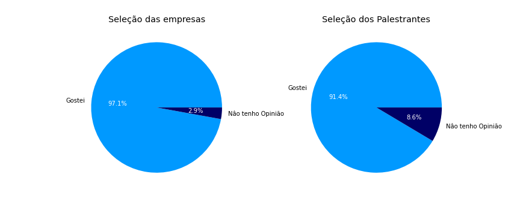
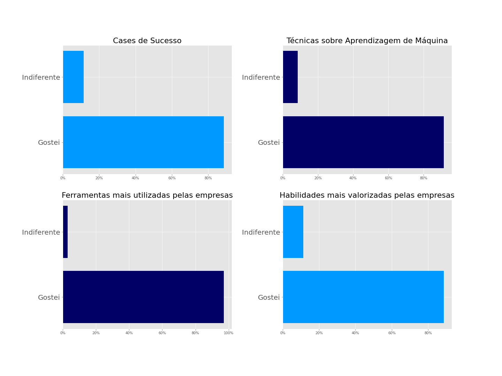
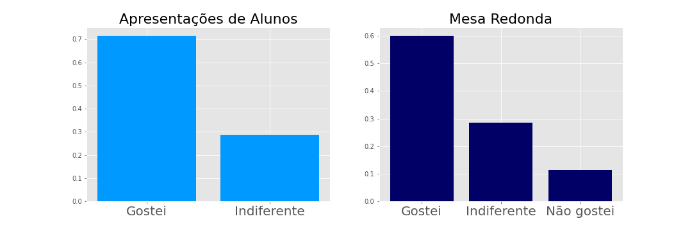
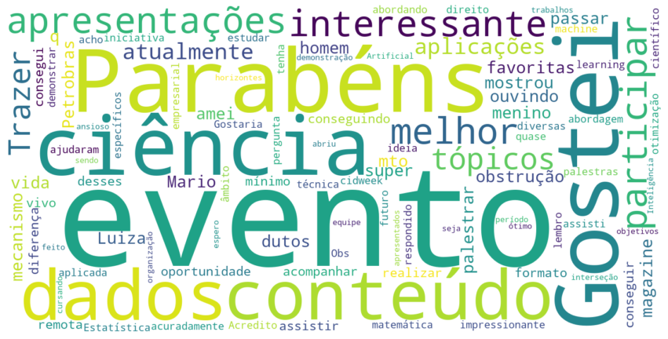

# Análise dos dados de feedback da CiDWeek

Como um bom grupo de Ciência de dados, nada melhor do que uma análise de dados do próprio evento! 

Sendo assim, com a conclusão da CiDWeek, foi enviado um formulário aos participantes para termos alguns feedbacks do evento. Neste formulário, dentre as perguntas associadas às frequências de participação no evento, realizamos perguntou-se as opiniões sobre as diferentes sessões do evento. 

Para esta análise, além dos gráficos sobre o evento, apresentamos também parte dos códigos, para efeito de aprendizagem e treinamento com a biblioteca matplotlib em linguagem Python. Assim, considerando `df` como nosso DataFrame de respostas, trazemos aqui a avaliação das seguintes perguntas que eram respondidas com "Gostei", "Não Gostei" ou "Indiferente/Não tenho opinião":

```
\>df.columns

Index([ 'Cases de sucesso',
        'Discussões sobre técnicas de Aprendizagem de Máquinas',
        'Técnicas mais utilizadas dentro da empresa',
        'Ferramentas mais utilizadas dentro da empresa',
        'Habilidades mais valorizadas pela empresa',
        'Seleção das empresas',
        'Seleção das/dos palestrantes',
        'Apresentações de alunas/os',
        'Mesa redonda'],  
dtype='object')
```

Começando com os animadores dados sobre `df['Seleção  das empresas'] ` e `df['Seleção das/dos palestrantes']`, temos:

```
plt.style.use('ggplot')
plt.figure(figsize = (12, 5))
plt.subplot(1, 2, 1)
labels = ['Gostei', 'Nâo tenho Opinião']
sizes = df['Seleção das empresas'].value_counts()
_, _, autotexts = plt.pie(sizes, labels=labels, autopct='%1.1f%%', colors=['#0099ff', '#000066'])
for autotext in autotexts:
    autotext.set_color('white')
plt.title('Seleção das empresas')

sizes2 = df['Seleção das/dos palestrantes'].value_counts()
plt.subplot(1, 2, 2)
_, _, autotexts = plt.pie(sizes2, labels= labels, autopct = '%1.1f%%', colors=['#0099ff', '#000066'])
for autotext in  autotexts:
    autotext.set_color('white')
plt.title('Seleção dos Palestrantes')

```

<!--  -->



Além disso, sobre as outras perguntas associadas aos temas que foram abordados pelas empresas e palestrantes, o resultado também foi bastante satisfatório de se observar!

```
plt.style.use('ggplot')
fig, ((ax1, ax2), (ax3, ax4)) = plt.subplots(2,2, facecolor='#ffffff',figsize=(20,15))
plt.subplots_adjust(wspace=0.3)
tick_labels = ['0%','20%', '40%', '60%', '80%', '100%']
label1 = ['Gostei',  'Indiferente']

ax1.barh(label1, df['Cases de sucesso'].value_counts()/len(df), color='#0099ff')
ax1.set_title("Cases de Sucesso", fontsize=22)
ax1.xaxis.set_ticklabels(tick_labels)
ax1.tick_params(axis='y', labelsize=20)

ax2.barh(label1, df['Técnicas mais utilizadas dentro da empresa'].value_counts()/len(df), color='#000066')
ax2.set_title("Técnicas sobre Aprendizagem de Máquina", fontsize=22)
ax2.xaxis.set_major_formatter(mtick.PercentFormatter())
ax2.tick_params(axis='y', labelsize=20)
ax2.xaxis.set_ticklabels(tick_labels)

ax3.barh(label1, df['Ferramentas mais utilizadas dentro da empresa'].value_counts()/len(df), color='#000066')
ax3.set_title('Ferramentas mais utilizadas pelas empresas',fontsize=22)
ax3.xaxis.set_ticklabels(tick_labels)
ax3.tick_params(axis='y', labelsize=20)

ax4.barh(label1, df['Habilidades mais valorizadas pela empresa'].value_counts()/len(df), color='#0099ff')
ax4.set_title('Habilidades mais valorizadas pelas empresas',fontsize=22)
ax4.xaxis.set_ticklabels(tick_labels)
ax4.tick_params(axis='y', labelsize=20)
```




Mas não somente de palestras de empresas o evento foi realizado. Também ocorreram palestras sobre as pesquisas individuais tanto de alunos-pesquisadores do grupo CiDAMO quanto alunos externos. E além destas apresentações, também foi relizada uma mesa redonda, onde foi feita uma conversa sobre como era o início da carreira de um Cientista de dados.

```
plt.style.use('ggplot')
fig, ((ax1, ax2)) = plt.subplots(1,2, facecolor='#ffffff',figsize=(15,5))

label1 = ['Gostei',  'Indiferente']
label2 = ['Gostei',  'Indiferente', 'Não gostei']

ax1.bar(label1, df['Apresentações de alunas/os'].value_counts() / len(presentes), color='#0099ff')
ax1.tick_params(axis='x', labelsize=20)
ax1.set_title('Apresentações de Alunos', fontsize=22)

ax2.bar(label2, df['Mesa redonda'].value_counts()/len(presentes), color='#000066')
ax2.tick_params(axis='x', labelsize=20)
ax2.set_title('Mesa Redonda', fontsize=22)
```



Infelizmente não pode agradar a todos :´(.

Sobre um feedback textual de quem participou, fizemos uma nuvem de palavras! E foi muito bom ver as maiores palavras!

